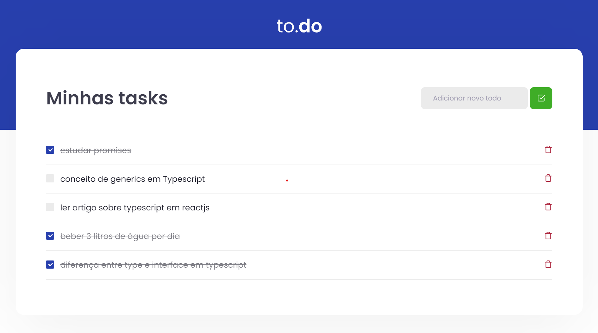

<h1 align="center">to.do</h1>
<h2 align="center">Rocketseat - Ignite - ReactJS</h2>

<h3 align="center">Chapter #1 - Challenge #1</h3>

  <a href="#-Projeto">Projeto</a>&nbsp;&nbsp;&nbsp;|&nbsp;&nbsp;&nbsp;
  <a href="#-Features">Features</a>&nbsp;&nbsp;&nbsp;|&nbsp;&nbsp;&nbsp;
  <a href="#-Tecnolgias">Tecnologias</a>&nbsp;&nbsp;&nbsp;|&nbsp;&nbsp;&nbsp;
  <a href="#-Como-executar">Como executar</a>&nbsp;&nbsp;&nbsp;|&nbsp;&nbsp;&nbsp;
  <a href="#-Licença">Licença</a>

  

## 💻 Projeto

to.do é uma aplicação de anotação de tarefas. Desafio desenvolvido em ReactJS no curso Ignite da [Rocketseat](https://rocketseat.com.br/).

## 🛠️ Features

- [x] Listas de tarefas
- [x] Adicionar novas tarefas
- [x] Remover tarefas
- [x] Verificar tarefas
- [x] Validação de tarefas vazias

## ✨ Tecnologias

Este projeto foi desenvolvido com as tecnologias abaixo:

- [React](https://reactjs.org)
- [TypeScript](https://www.typescriptlang.org)
- [Babel](https://babeljs.io/)
- [Webpack](https://webpack.js.org/)
- [Jest](https://jestjs.io/)

## 🚀 Como usar

- Clone o repositório
- Instale as dependencias com `yarn`
- Execute a aplicação com `yarn dev`
- Acesse [`localhost:8080`](http://localhost:8080) no seu navegador
- Execute o teste `yarn test`

## 📄 Licença

Este projeto está sob linceça MIT. Leia sobre [LICENSE](./LICENSE) para mais detalhes.

---

feito por [samael melo](https://br.linkedin.com/in/samael-melo) em conjunto com time RocketSeat.
